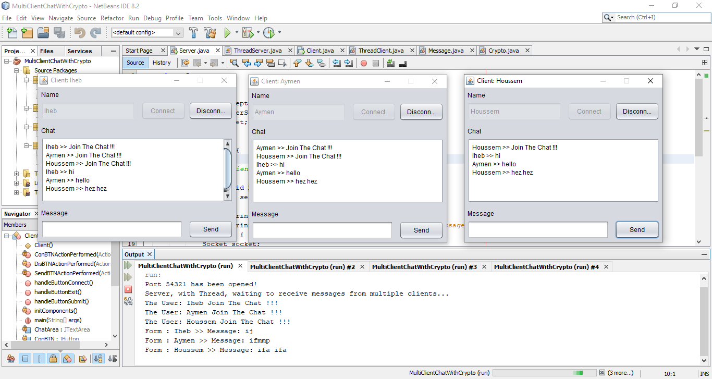

<h1 align="center">
    
</h1>

<h3 align="center">
  MultiClient Chat GUI (JAVA Swing)
</h3>

<p align="center">With Caesar Cipher</p>

## Preview



## How To Use

1. Download the project as ZIP.
2. Unzip the project to get all the files.
3. Inside the netbeans, choose File, then Open Project, and choose the file you got after decompressing.
4. First make run to Server.java.
5. Make run to Client.java, Once, twice, or more, as you wish.
6. Enter any name you want in each client interface and click Connect. Congratulations, you can now send messages between users.
7. After you have finished using it, all you have to do is click on Disconnect.

## Project structure

```shell
MultiClientChatWithCrypto/          
├── build/                       
│   ├── Client/        
│   ├── Crypto/ 
│   ├── Message/                      
│   └── Server/                 
├── nbproject/                   
├── src/                       
│   ├── Client/        
│   ├── Crypto/ 
│   ├── Message/                      
│   └── Server/             
└── test/                               
```